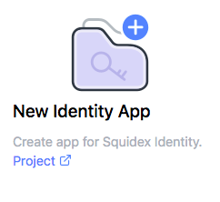
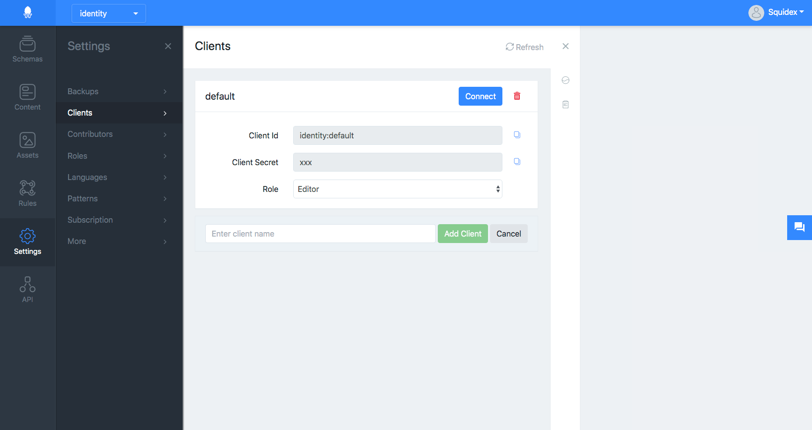
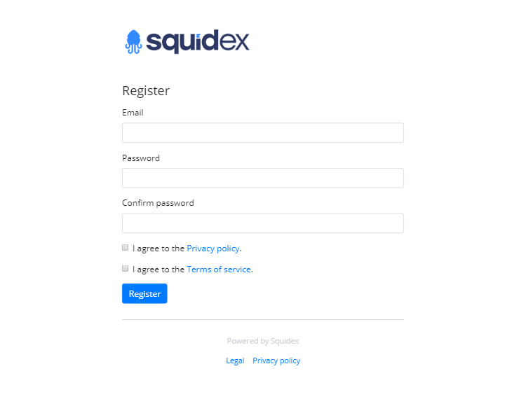

# How to use Squidex Identity

## About Squidex Identity

Squidex Identity server based on Squidex Headless CMS. It implements the OpenId Connect and OAuth 2.0 protocols to act as a central single sign on server. 
> https://github.com/Squidex/squidex-identity

## 1. Setup of Squidex identity
* Clone Squidex.Identity repository

    `
git clone https://github.com/Squidex/squidex-identity.git
`

* Create an identity app in your Squidex instance (local or cloud)

    
    
* Update the configuration with the url to your squidex instance and the client id and secret of the default client.

    
    
    `Squidex.Identity/appsettings.json`
    ```json
    "app": {
        ...
        "url": "http://localhost:5000",
        "clientId": "yourIdentityAppName",
        "oidcClient": "identity:default",
        "clientSecret": "xxx",
        ...
        }
    ```

## 2. General application settings:
If you create a identity app in Squidex you will see a schema with the settings, where you can upload a logo, footer text, privacy settings and so on. Most settings are optional but you must setup credentials to an smpt server. 


    
Email Delivery Service: 
* https://www.mailjet.com/    
* https://www.sendgrid.com/

## 3. External authentication providers
If you want to use external authentication providers you can setup them in the authentication schemes section, here is an example for Google.

You have to create an OAuth 2.0-Client-IDs in the google developer console. You have to define the redirect_uri in this process and you must use 
`http://localhost:3500/signin-google`


## 4. External clients
When you want to connect an external application to Squidex identity you have to configure a client. This is a little bit complicated, but you can find all settings here: http://docs.identityserver.io/en/latest/reference/client.html

* #### Self Hosted
    Create new content in Client
    
    
    

    Update the Squidex configuration
    
    `Squidex/appsettings.json`
    ```json
    "identity": {
      ...
      "oidcName": "selfHostedName",
      "oidcAuthority": "http://localhost:3500/",
      "oidcClient": "client:selfHosted",
      "oidcSecret": "xxx",
      ...
    }  
    ```  

    Then you can register with self-host.
    
    
