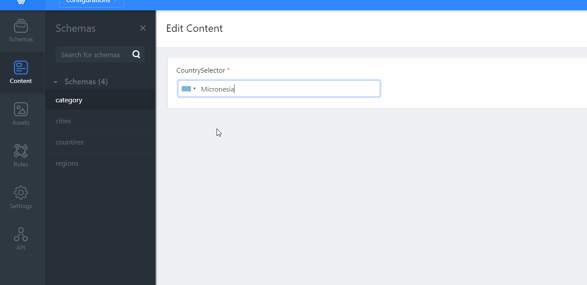
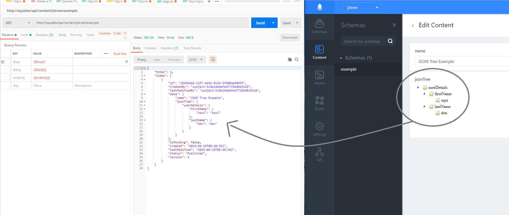

# Custom editors

## How to write your own editor

Custom editors are enabling developers to replace the default editors with HTML5 applications so the editing experience of the Squidex Web App can be customized.

Technically speaking a UI editor lives in a sandboxed iframe,which interacts with the web application through a small SDK using messaging. This SDK is a proxy of the Angular [ControlValueAccessor](https://angular.io/api/forms/ControlValueAccessor), without having the dependencies to Angular itself.


Lets see how the code looks like:

```html
<!DOCTYPE html>
<html>

<head>
    <meta charset="utf-8">

    <!-- Load the editor sdk from the local folder or https://cloud.squidex.io/scripts/editor-sdk.js -->
    <script src="editor-sdk.js"></script>
    <script src="https://cdn.ckeditor.com/ckeditor5/10.0.0/classic/ckeditor.js"></script>

    <style>
        .ck-editor__editable {
            min-height: 250px;
        }
    </style>
</head>

<body>
    <textarea name="content" id="editor"></textarea>

    <script>
        var element = document.getElementById('editor');
        ClassicEditor
            .create(element)
            .catch(error => {
                console.error(error);
            })
            .then(editor => {
                // When the field is instantiated it notified the UI that it has been loaded.
                var field = new SquidexFormField();
                // Handle the value change event and set the text to the editor.
                field.onValueChanged(function (value) {
                    if (value) {
                        editor.setData(value);
                    }
                });
                // Disable the editor when it should be disabled.
                field.onDisabled(function (disabled) {
                    editor.set('isReadOnly', disabled);
                });
                editor.model.document.on('change', function () {
                    var data = editor.getData();
                    // Notify the UI that the value has been changed. Will be used to trigger validation.
                    field.valueChanged(data);
                });
                editor.ui.focusTracker.on('change:isFocused', function (event, name, isFocused) {
                    if (!isFocused) {
                        // Notify the UI that the value has been touched.
                        field.touched();
                    }
                });
            });
    </script>
</body>

</html>
```

You just have to reference the editor SDK and handle the events. You also have to push the current value to the web application whenever it changes. Validation will happen automatically then.

## All Examples

Also, we have more example you can use them on your apps.

### 1. Simple CKE Editor

Reference: https://squidex.github.io/squidex-samples/editors/cke-simple.html


Clone the sample and configure the CKE editor as you need it.

### 2. Country selector

Reference: https://squidex.github.io/squidex-samples/editors/country-selector.html



### 3. Product taxonomy

Reference: https://squidex.github.io/squidex-samples/editors/tags-category.html

The data format is a list of url like paths for each product category that will be converted to a tree strucuture.

``` json
[
  "/laptops-and-netbooks/thinkpad-x-series-chromebook-laptops/",
  "/laptops-and-netbooks/thinkpad-edge-laptops/thinkpad-edge-e330/",
  "/laptops-and-netbooks/ideapad-s-series-netbooks/ideapad-s210-notebook/",
  "/tablets/a-series/a2109-tablet/",
  "/servers/thinkserver/rs110/6438/",
  "/desktops-and-all-in-ones/thinkcentre-m-series-desktops/m715q/10m2/",
  "/phones/a-series/a328-smartphone/"
]

```


### 4. JSON Tree

Reference: https://github.com/Squidex/squidex-samples/blob/master/editors/jstree-editor.html

Create a visual tree for a JSON object.


