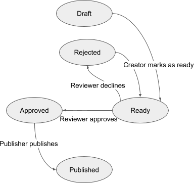
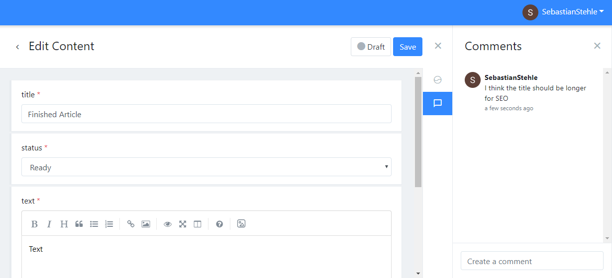
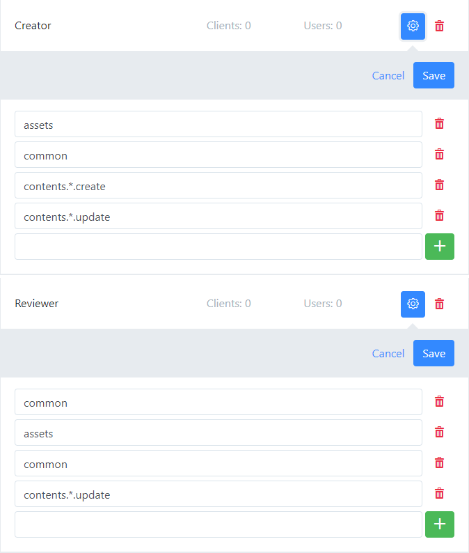
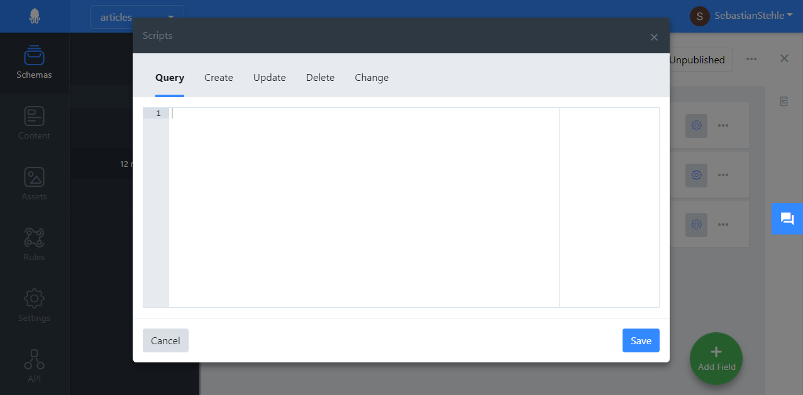
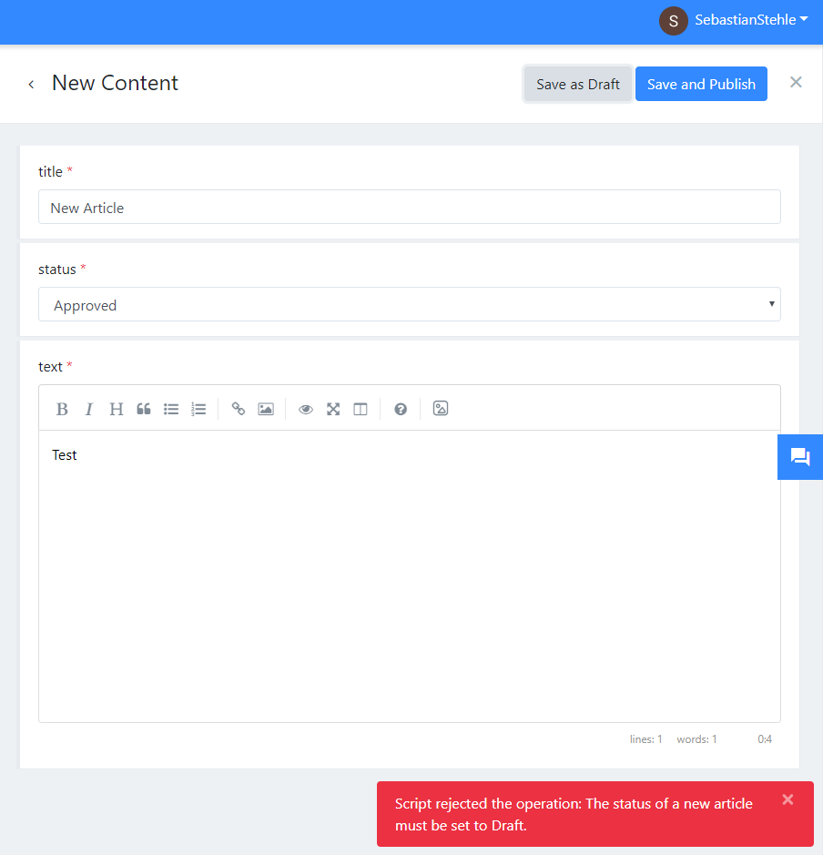

# Custom Workflows

Custom workflows have been already requested several times and we will work on it in 2019, but until then this guide will teach you how to implement custom workflows. It will provide a setup that can be much more flexbible than what we are planing.

## Our requirements

In our scenario we manage articles and have three roles:

1. **Creators**: Writes articles and when they are done they mark an article as `Ready`.
2. **Reviewers**: Reviews articles and either mark an article as `Approved` or `Rejected`.
3. **Publisher**: Decides when to publish an article and should only publish approved articles.

Therefore we have 3 states for content:

1. `Draft`
3. `Ready`
3. `Approved`
3. `Rejected`
4. `Published`

The following diagram vizualizes our workflow.



## Step 1: Create the schema

In the first step we create a schema. We keep it simple and define 3 fields:

1. **Title**: The title of the article.
2. **Status**: The status of the article as string field with a dropdown editor.
3. **Text**: The text as markdown.

We will make set the first two fields as list fields, which means we will see them in our content lists.

The schema in the UI:


Now we can very easily see all articles and their status. But as a reviewer I am probably only interested in the articles that is ready to be reviewed.

We can search for these articles with the following query: `$filter=data/status/iv eq 'Ready'`

It looks a little bit like technical stuff and our reviewers should not care about this. But we can save the query and give it a friendly name so it can be reused.


The basic setup is already done and it might work well enough in a small team. It requires a little bit of discipline and corporation of all team members. But if we have critical content like product texts or a big team where we don't want to rely that everybody has a good day we need some rules to enforce that our workflow is used correctly.

You can also use the new comments feature to share information between reviewer and writer:



## Step 2: Enforce the workflow

We start by creating our Roles in Squidex:



As you can see in the screenshot above, the `Creator` can only create and update content, but not publish it and the `Reviewer` can only update content. we use the default role `Editor` for the `Publisher`.

So we solved the problem that only the `Publisher` should be able to publish, unpublish content, but there is still something left to do.

We have to ensure that:

1. The `Creator` must set the initial status to `Draft`.
2. The `Creator` can only change the status to `Ready`.
2. The `Creator` can only update an article when the status is `Draft` or `Rejected`.
3. The `Reviewer` can only change the status to `Approved` or `Rejected`.
4. The `Publisher` can only set the status to `Published`.
5. The `Publisher` can only publish the content when it the status is `Published` (to be consistent).

I will not show everything in this tutorial, it is just too much and the solution is the same for all roles, but we will show you how we implemented it for the `Creator`:

The solution is scripting. If you click the three dots in the schema editor a menu will pop up with a menu item to the scripting editor. Here you can define scripts that are invoked when a content item is queried, created, updated, deleted or when the status is changed.



### The create script:

The script for creating content is very simple:

```jscript
// Check the status field is set to draft.
if (ctx.data.status.iv !== 'Draft') {
    // If not reject this operation with a custom validation message.
    reject('The status of a new article must be set to Draft');
}
```

Thats it, we do not have to do more, because the permission system already enforces that only `Creators` can create content.

The UI will show the error message from the script:




### The update script:

Lets have a look to the update script:

```jscript
// Our code for the Creator
if (ctx.user.role.indexOf('Creator')) {
    // Check the old status of our content.
    if (ctx.oldData.status.iv !== 'Draft' && ctx.oldData.status.iv !== 'Rejected') {
        disallow('You are not allowed to edit content that has been published already.');
    }

    if (ctx.data.status.iv !== 'Draft' && ctx.data.status.iv !== 'Ready') {
        reject('You only set the status to Draft or Ready');
    }
}
```

What we do:

1. We check if the current user is a `Creator`.
2. If the content has the wrong status we cancel the process with the `disallow` function. Then the API responds with a `HTTP 403: Forbidden` and the UI will show an error message.
3. if the content is changed to an invalid status we cancel the update with the 'reject' function. Then the API respons with a `HTTP 400: Bad Request` and the UI will show the error message.

The rest of the requirements can be implemented with a some more `if`-statements.

## Summary

You can already implement custom workflow with Squidex, but this solutions has several small issues:

1. You have a second field for the status of the addition.
2. The user experience could be better.
3. You have to define, write and define the scripts.

But on the other side there are also some points on the PRO side:

1. You can implement very fine grained workflows and you are not restricted by a built-in solution.
2. You can even make the Status field localizable and ensure that all texts are reviewed from different person before you publish a content.